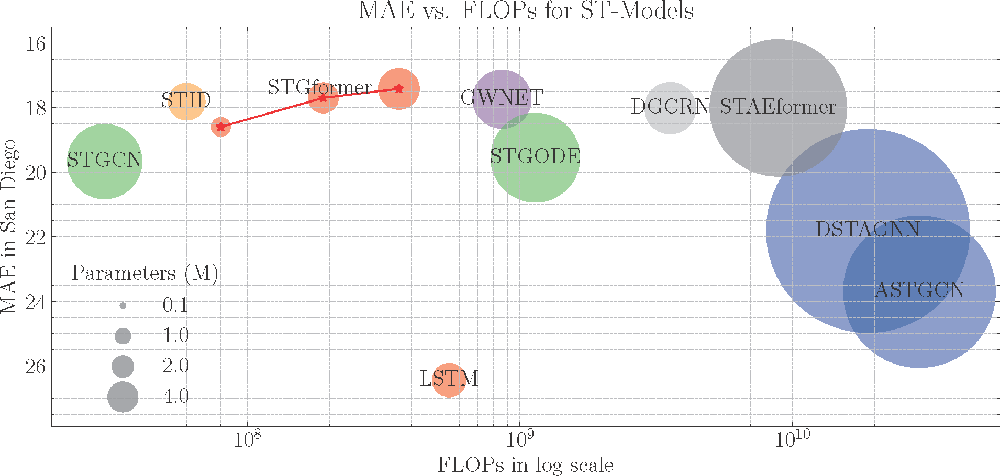

# STGformer: Efficient Spatiotemporal Graph Transformer for Traffic Forecasting

STGformer is a novel spatiotemporal graph transformer architecture designed for efficient and accurate traffic forecasting. It balances the strengths of Graph Convolutional Networks (GCNs) and Transformers, enabling effective modeling of both global and local traffic patterns while maintaining a manageable computational footprint.


## Key Features

- **Efficient Spatiotemporal Modeling**: STGformer captures high-order spatiotemporal interactions in a single layer, significantly reducing computational cost compared to traditional multi-layer approaches.
- **Balanced Architecture**: Combines the advantages of GCNs and Transformers for comprehensive traffic pattern analysis.
- **Scalability**: Designed to handle large-scale road networks with superior efficiency.
- **State-of-the-Art Performance**: Outperforms existing methods on various traffic forecasting benchmarks, including the challenging LargeST dataset.

## Performance Highlights

- 100x speedup compared to STAEformer during batch inference on a California road graph with 8,600 sensors.
- 99.8% reduction in GPU memory usage compared to STAEformer.
- Superior performance on the LargeST benchmark compared to state-of-the-art Transformer-based methods like PDFormer and STAEformer.

## Installation

```bash
git clone https://github.com/Dreamzz5/STGformer.git
cd STGformer
```

## Usage

```bash
cd model
python train.py
```

## Cite This Work

If you find this project useful for your research, please consider citing our paper:

```bibtex
@article{wang2024stgformer,
  title={STGformer: Efficient Spatiotemporal Graph Transformer for Traffic Forecasting},
  author={Wang, Hongjun and Chen, Jiyuan and Pan, Tong and Dong, Zheng and Zhang, Lingyu and Jiang, Renhe and Song, Xuan},
  journal={},
  year={2024}
}
```
